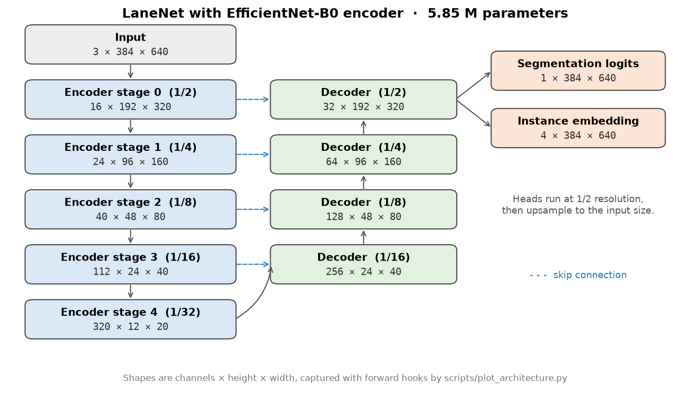

# Real-Time Lane Detection (LaneNet-style, PyTorch)

[](https://github.com/sandeepvijayarao09/realtime-lane-detection/actions/workflows/ci.yml)

An encoder-decoder lane segmentation network with an instance-embedding head, a TuSimple data loader, training loop, inference engine and curve-fitting post-processing.



<sub>Generated by `python scripts/plot_architecture.py`; every shape comes from forward hooks on the actual model.</sub>

## Status

- The model, data pipeline, training loop and inference engine run end to end and are covered by tests.
- **No trained weights are included, and no TuSimple accuracy has been measured.** Training on TuSimple needs the dataset and a GPU, and hasn't been done yet. Until it is, this repo makes no accuracy claims.
- The one number measured here is CPU latency (below).

## Highlights

- **Two backbones**: EfficientNet-B0 or MobileNetV2 from torchvision, optionally with ImageNet weights. The encoder is cut at strides 2/4/8/16/32 and the channel counts are read from a dummy forward pass, not hardcoded.
- **UNet-style decoder** with skip connections. Accepts any input size, not only multiples of 32.
- **Two heads**: a binary lane-segmentation head and a per-pixel embedding head (LaneNet's instance branch), both upsampled to the input size.
- **TuSimple loader** that rasterizes the `lanes` / `h_samples` polylines into binary and instance masks, with albumentations augmentation.
- **Training**: AdamW, cosine schedule, gradient clipping, AMP on CUDA, TensorBoard logging, checkpointing and early stopping.
- **Inference**: single image, batch, video and webcam, TorchScript export, DBSCAN clustering and polynomial lane fitting.

## Measured CPU latency

Network forward pass only, batch 1, 384×640 input, random weights (latency doesn't depend on training). From [`results/cpu_latency.json`](results/cpu_latency.json):

| Backbone | Params | Median latency | Hardware |
|----------|--------|----------------|----------|
| EfficientNet-B0 | 5.85 M | 138 ms | Apple M5 Pro, CPU, 1 thread, PyTorch 2.14.1 |
| MobileNetV2 | 4.02 M | 89 ms | Apple M5 Pro, CPU, 1 thread, PyTorch 2.14.1 |

Re-run on your machine with `python scripts/benchmark_cpu.py --threads 1`. GPU numbers aren't measured yet.

## Install

Python 3.12+.

```bash
git clone https://github.com/sandeepvijayarao09/realtime-lane-detection.git
cd realtime-lane-detection
python3.12 -m venv .venv && source .venv/bin/activate
pip install -r requirements-dev.txt
# CPU-only Linux machine? Avoid the CUDA wheels:
# pip install -r requirements-dev.txt --extra-index-url https://download.pytorch.org/whl/cpu
pytest -q
```

`requirements.txt` uses `opencv-python-headless` (needed by albumentations), so image and video modes that write files work without a display. Webcam mode and pop-up windows need a GUI build of OpenCV.

## Usage

All commands run from the repository root.

### Train on TuSimple

Download the [TuSimple lane benchmark](https://github.com/TuSimple/tusimple-benchmark) and point `--data-dir` at `train_set/` (the folder with `label_data_*.json` and `clips/`):

```bash
python -m src.train --data-dir /path/to/tusimple/train_set \
    --epochs 50 --batch-size 16 --lr 1e-3 --backbone efficientnet --output-dir ./outputs
```

The training loop optimises the segmentation head (BCE). The embedding head is in the model and returned by the loader's `instance` maps, but a discriminative loss for it isn't implemented yet.

Smoke-test the whole loop without the dataset. This uses synthetic noise images with random lines, so it only checks that training runs:

```bash
python -m src.train --use-mock-data --data-dir /tmp/lane_mock \
    --epochs 1 --batch-size 4 --no-pretrained --device cpu --num-workers 0
```

### Inference

```bash
python demo.py --image road.jpg --model outputs/best_checkpoint.pth --output result.jpg --no-display
python demo.py --video drive.mp4 --model outputs/best_checkpoint.pth --output result.mp4
python demo.py --directory frames/ --model outputs/best_checkpoint.pth --output out_dir/
python demo.py --webcam --model outputs/best_checkpoint.pth --duration 30
```

Without `--model` the network runs with random weights and prints a warning; the output is meaningless.

### From Python

```python
from src.model import create_lanenet
from src.inference import LaneInferenceEngine

model = create_lanenet(backbone="mobilenet", pretrained=True)   # ImageNet encoder
engine = LaneInferenceEngine(model_path="outputs/best_checkpoint.pth", device="cpu",
                             backbone="efficientnet")
lanes = engine.detect_lanes(image_bgr)        # list of Nx2 lane curves
engine.export_torchscript("lanenet.pt")
```

## Project structure

```
realtime-lane-detection/
├── src/
│   ├── model.py           # LaneNet: backbone stages, decoder, heads
│   ├── dataset.py         # TuSimple loader + rasterization, synthetic smoke-test data
│   ├── train.py           # training loop (python -m src.train)
│   ├── inference.py       # image/batch/video/webcam inference, TorchScript export
│   ├── postprocess.py     # thresholding, DBSCAN, curve fitting, drawing
│   └── metrics.py         # pixel F1/accuracy/IoU, latency profiler
├── scripts/
│   ├── benchmark_cpu.py   # writes results/cpu_latency.json
│   └── plot_architecture.py
├── tests/                 # forward passes, TuSimple rasterization, metrics, inference
├── results/cpu_latency.json
├── assets/architecture.png
└── demo.py
```

## Tests

`pytest -q` runs 31 CPU-only tests:

- forward and backward passes for both backbones at several input sizes;
- encoder stride and channel checks;
- a check that LaneNet's weight init leaves the (pretrained) encoder untouched;
- TuSimple rasterization and loading on a tiny generated fixture;
- metric correctness;
- an inference-engine checkpoint round trip.

## Next steps

- Train on TuSimple and report the official TuSimple accuracy / FP / FN, with weights published as a release.
- Discriminative loss for the embedding head.
- GPU latency on stated hardware.

## License

MIT, see [LICENSE](LICENSE).
